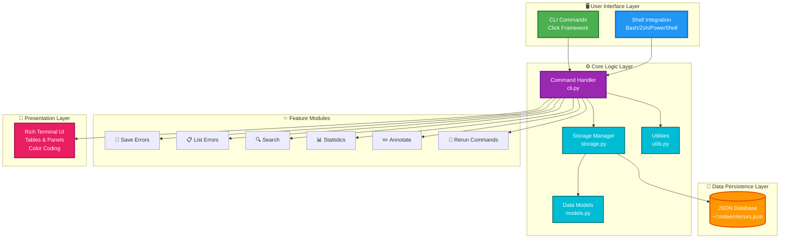

# 📦 PROJECT STRUCTURE

Complete overview of the Noteerr project structure and components.

## 🏗️ Architecture Diagram



**Architecture Overview:**

Noteerr follows a layered architecture pattern:

1. **User Interface Layer** - Entry points via CLI or shell integration
2. **Core Logic Layer** - Command processing, business logic, and utilities
3. **Data Persistence Layer** - JSON-based storage for error entries
4. **Feature Modules** - Individual command implementations
5. **Presentation Layer** - Rich terminal UI with formatted output

## 🗂️ Directory Structure

```
Noteerr/
├── .github/                          # GitHub configuration
│   ├── workflows/
│   │   └── deploy.yml                # CI/CD pipeline for automated deployment
│   └── ISSUE_TEMPLATE/
│       ├── bug_report.md             # Bug report template
│       └── feature_request.md        # Feature request template
│
├── src/                              # Source code
│   └── noteerr/
│       ├── __init__.py               # Package initialization
│       ├── cli.py                    # Main CLI interface (Click-based)
│       ├── storage.py                # JSON storage backend
│       ├── models.py                 # Data models (ErrorEntry)
│       └── utils.py                  # Utility functions
│
├── scripts/                          # Shell integration scripts
│   ├── bash-integration.sh           # Bash auto-capture
│   ├── zsh-integration.sh            # Zsh auto-capture
│   └── powershell-integration.ps1    # PowerShell auto-capture
│
├── setup.py                          # Package setup (setuptools)
├── pyproject.toml                    # Modern Python packaging config
├── requirements.txt                  # Python dependencies
├── MANIFEST.in                       # Package distribution manifest
├── .gitignore                        # Git ignore rules
├── LICENSE                           # MIT License
│
├── README.md                         # Main documentation
├── QUICKSTART.md                     # Quick start guide
├── EXAMPLES.md                       # Usage examples
├── DEPLOYMENT.md                     # Deployment guide
├── CONTRIBUTING.md                   # Contribution guidelines
├── CHANGELOG.md                      # Version history
│
└── test_noteerr.py                   # Installation test script
```

## 🔧 Core Components

### 1. CLI Interface (`cli.py`)

**Purpose:** Main command-line interface using Click framework

**Commands:**
- `save` - Save error with notes and tags
- `list` - Display recent errors in table format
- `search` - Search errors by keyword
- `show` - Show detailed error information
- `annotate` - Add/update notes and tags
- `rerun` - Re-execute a failed command
- `stats` - Display error statistics
- `delete` - Remove a specific error
- `clear` - Remove all errors
- `install` - Show shell integration instructions

**Key Features:**
- Rich terminal UI with colored output
- Table formatting for lists
- Panel views for detailed info
- Error handling and validation

### 2. Storage Backend (`storage.py`)

**Purpose:** Persistent JSON-based data storage

**Key Methods:**
- `add_entry()` - Create new error entry
- `get_all_entries()` - Retrieve all entries
- `get_entry_by_id()` - Get specific entry
- `update_entry()` - Modify entry notes/tags
- `delete_entry()` - Remove entry
- `search_entries()` - Full-text search
- `get_statistics()` - Calculate stats
- `clear_all()` - Remove all entries

**Storage Location:**
- Linux/Mac: `~/.noteerr/errors.json`
- Windows: `C:\Users\{username}\.noteerr\errors.json`

### 3. Data Models (`models.py`)

**ErrorEntry** dataclass:
```python
{
    "id": int,
    "timestamp": str (ISO format),
    "command": str,
    "error": str,
    "exit_code": int,
    "directory": str,
    "notes": str,
    "tags": list[str]
}
```

### 4. Utilities (`utils.py`)

**Helper Functions:**
- `get_last_command()` - Extract from shell history
- `get_last_exit_code()` - Get error code
- `truncate_text()` - Format long text
- `run_command()` - Execute shell commands
- `format_tags()` - Tag display formatting
- `parse_tags()` - Parse tag input

### 5. Shell Integration Scripts

**Purpose:** Automatic error capture in shell environments

**Bash/Zsh:**
- Hook into `PROMPT_COMMAND` / `precmd`
- Capture exit codes and commands
- Set environment variables for `noteerr`

**PowerShell:**
- Override prompt function
- Track `$?` and `$LASTEXITCODE`
- Capture error messages

## 📊 Data Flow

```
User runs failing command
         ↓
Shell captures exit code & error
         ↓
Shell integration sets env vars
         ↓
User runs: noteerr save "note"
         ↓
CLI parses arguments
         ↓
Storage creates ErrorEntry
         ↓
JSON file updated
         ↓
Confirmation displayed
```

## 🔌 Dependencies

### Production
- `click` (≥8.0.0) - CLI framework
- `colorama` (≥0.4.4) - Cross-platform colored output
- `rich` (≥10.0.0) - Rich terminal formatting

### Development
- `build` - Package building
- `twine` - PyPI uploading
- `pytest` - Testing (optional)
- `pyinstaller` - Executable creation (optional)

## 🚀 Entry Points

### Command Line
```bash
noteerr [COMMAND] [OPTIONS] [ARGUMENTS]
```

### Python Module
```python
from noteerr.storage import Storage
from noteerr.models import ErrorEntry

storage = Storage()
entry = storage.add_entry(
    command="npm start",
    error="missing script",
    exit_code=1,
    directory="/path/to/project"
)
```

## 🎨 UI Components

### Rich Library Usage

**Tables:**
- Error listings with columns: ID, Command, Error, Date, Tags
- Statistics display

**Panels:**
- Detailed error views
- Error output display

**Text Formatting:**
- Color coding: errors (red), commands (cyan), notes (yellow)
- Truncation for readability
- Syntax highlighting

## 📁 File Locations

### Package Installation
```
# Site-packages location (varies by system)
site-packages/
└── noteerr/
    ├── __init__.py
    ├── cli.py
    ├── storage.py
    ├── models.py
    └── utils.py

# Scripts directory
Scripts/  or  bin/
└── noteerr  (or noteerr.exe on Windows)
```

### User Data
```
~/.noteerr/
└── errors.json
```

## 🔄 Development Workflow

### Setup
```bash
git clone <repo>
cd noteerr
python -m venv venv
source venv/bin/activate
pip install -e .
```

### Testing
```bash
python test_noteerr.py
noteerr --version
noteerr list
```

### Building
```bash
python -m build
# Creates: dist/noteerr-1.0.0.tar.gz and .whl
```

### Deployment
```bash
python -m twine upload dist/*
# Or use GitHub Actions workflow
```

## 📝 Configuration Files

### `setup.py`
- Classic setuptools configuration
- Entry points definition
- Package metadata

### `pyproject.toml`
- Modern Python packaging (PEP 518)
- Build system requirements
- Project dependencies

### `MANIFEST.in`
- Include additional files in distribution
- Scripts, documentation, etc.

### `.gitignore`
- Python artifacts
- Virtual environments
- Build directories

## 🎯 Key Design Decisions

1. **JSON Storage**: Simple, portable, human-readable
2. **Click Framework**: Robust CLI with good help generation
3. **Rich Library**: Beautiful terminal UI without external dependencies
4. **Shell Integration**: Optional but powerful feature
5. **Local Storage**: Privacy-focused, no cloud required
6. **Cross-Platform**: Works on Windows, macOS, Linux

## 🔐 Security Considerations

- All data stored locally
- No network requests
- No credentials stored
- File permissions follow OS defaults
- Command execution requires confirmation (`rerun`)

## 🎓 Learning Resources

**Technologies Used:**
- Click: https://click.palletsprojects.com/
- Rich: https://rich.readthedocs.io/
- Python Packaging: https://packaging.python.org/

**Similar Tools for Inspiration:**
- `fuck` (thefuck) - Command correction
- `tldr` - Simplified man pages
- `howdoi` - Command-line StackOverflow

---

**This structure is designed for:**
✅ Easy maintenance
✅ Simple deployment
✅ Clean separation of concerns
✅ Extensibility
✅ Cross-platform compatibility
