# 🚨 Noteerr - Command Error Memory Tool

**Never forget how you fixed that mysterious bug again!**

Noteerr is a CLI tool that automatically logs, annotates, and recalls command errors. Think of it as a "command error memory bank" that helps you track mistakes and their solutions.


---

## 📦 Installation - As Easy as Git!

### Quick Install

#### Windows 🖱️
```powershell
# Winget (Windows 10/11)
winget install YourPublisher.Noteerr

# Chocolatey
choco install noteerr

# Or double-click install.bat
```

#### macOS 🍺
```bash
# Homebrew
brew install noteerr

# Or run installer
bash install.sh
```

#### Linux 🐧
```bash
# Homebrew
brew install noteerr

# pip (all platforms)
pip install noteerr
```

#### From Source
**Windows:** Double-click `install.bat`  
**macOS/Linux:** `bash install.sh`

📖 **See [INSTALL.md](INSTALL.md) for detailed instructions** | [Distribution Guide](DISTRIBUTION.md)

---

## ✨ Features

- 🎯 **Automatic Error Capture** - Logs failed commands with exit codes and error messages
- 📝 **Annotation System** - Add notes about fixes and workarounds
- 🔍 **Powerful Search** - Find errors by command, error text, notes, or tags
- 🏷️ **Tag Management** - Categorize errors (git, npm, docker, etc.)
- 📊 **Statistics** - Track most common errors and troublesome commands
- 🔄 **Command Replay** - Re-execute previous failing commands
- 🎨 **Rich Terminal UI** - Beautiful, colored output with tables
- 🐚 **Shell Integration** - Auto-capture for Bash, Zsh, and PowerShell
- 📋 **Copy to Clipboard** - Copy error details in text, markdown, or JSON format _(New in v1.1.0)_
- 🔒 **Smart Duplicate Detection** - Prevents saving duplicate errors automatically _(New in v1.1.0)_
- 📁 **Project Organization** - Tag errors by project for multi-project management _(New in v1.1.0)_

## 🚀 Quick Start

### Installation (Simple as Git!)

#### Windows - Double-Click Install 🖱️

1. **Download/Clone** this repository
2. **Double-click** `install.bat`
3. **Restart** your terminal
4. **Done!** Run `noteerr --version`

No terminal needed! Just double-click and go.

#### macOS / Linux - One Command 🚀

```bash
# Download and install
git clone https://github.com/yourusername/noteerr.git
cd noteerr
bash install.sh

# Restart terminal, verify
noteerr --version
```

#### Alternative: PyPI (When Published)

```bash
pip install noteerr
```

#### Already Installed? Fix PATH Issues

```bash
# Automatic PATH fixer
noteerr install --check-path
```

---

### Installation (Advanced)

<details>
<summary>Click for advanced installation options</summary>

#### Windows (PowerShell)

```powershell
# 1. Clone or download the repository
git clone https://github.com/yourusername/noteerr.git
cd noteerr

# 2. Run the installer (handles everything automatically)
.\install.ps1

# 3. Close and reopen your terminal, then verify:
noteerr --version
```

#### Windows (Manual)

```powershell
# Install with pip
pip install --user -e .

# Fix PATH if noteerr is not recognized
noteerr install --check-path
```

#### macOS / Linux (Manual)

```bash
# Install with pip
pip install --user -e .

# Or install from PyPI (once published)
pip install noteerr
```

**First time setup?** If `noteerr` command is not found:
```bash
# Run the built-in PATH checker
python -m noteerr install --check-path
```

</details>

---

### Basic Usage

```bash
# Run a command that fails, then save it
npm start || noteerr save "forgot to run npm install"

# List recent errors
noteerr list

# Search for specific errors
noteerr search "npm"

# Show detailed error info
noteerr show 1

# Add notes to an error
noteerr annotate 1 "fixed by running npm install"
```

## 📚 Complete Command Reference

### Save Errors

```bash
# Save with manual note
your-command || noteerr save "description of the fix"

# Save with tags
noteerr save "permission issue" --tags docker,linux

# Save with project name (v1.1.0+)
noteerr save "error description" --project myapp

# Force save even if duplicate detected (v1.1.0+)
noteerr save "error description" --force

# Save with specific command and error
noteerr save --command "git push" --error "rejected" "need to pull first"
```

### View & Search

```bash
# List recent errors (default: 10)
noteerr list

# List all errors
noteerr list --all

# List with custom limit
noteerr list --limit 20

# Filter by tag
noteerr list --tag git

# Filter by project (v1.1.0+)
noteerr list --project myapp

# Search by any text
noteerr search "permission denied"

# Show detailed error
noteerr show 5
```

### Copy to Clipboard (v1.1.0+)

```bash
# Copy error in text format
noteerr copy 1

# Copy in markdown format
noteerr copy 1 --format markdown

# Copy in JSON format
noteerr copy 1 --format json
```

### Project Management (v1.1.0+)

```bash
# List all projects with error counts
noteerr projects

# Save error with project
noteerr save "bug description" --project frontend

# List errors for specific project
noteerr list --project backend
```

### Annotate & Manage

```bash
# Add notes to an error
noteerr annotate 1 "run npm install first"

# Add notes with tags
noteerr annotate 1 "updated Node version" --tags npm,node

# Delete an error
noteerr delete 1

# Clear all errors (be careful!)
noteerr clear
```

### Advanced Features

```bash
# Re-run a previous command
noteerr rerun 5

# Dry run (show without executing)
noteerr rerun 5 --dry-run

# View statistics
noteerr stats

# Stats for specific tag
noteerr stats --tag docker
```

## 🐚 Shell Integration

Enable automatic error capture by adding integration to your shell:

### Bash

Add to `~/.bashrc`:

```bash
source /path/to/noteerr/scripts/bash-integration.sh
```

### Zsh

Add to `~/.zshrc`:

```bash
source /path/to/noteerr/scripts/zsh-integration.sh
```

### PowerShell

Add to your PowerShell profile (`$PROFILE`):

```powershell
. C:\path\to\noteerr\scripts\powershell-integration.ps1
```

### Quick Aliases

After integration, you get these handy aliases:

- `ne` → `noteerr save` (quick save)
- `nel` → `noteerr list` (quick list)
- `nes` → `noteerr search` (quick search)

## 📖 Real-World Examples

### Example 1: Git Push Failure

```bash
$ git push
! [rejected] main -> main (fetch first)

$ noteerr save "remote has changes I don't have" --tags git
✓ Saved error #1
  Command: git push
  Error: ! [rejected] main -> main (fetch first)
  Notes: remote has changes I don't have
  Tags: [git]

$ noteerr annotate 1 "always git pull before push"
✓ Updated error #1
```

### Example 2: NPM Issues

```bash
$ npm start
Error: missing script: start

$ noteerr save "package.json missing start script" --tags npm
✓ Saved error #2

# Later, search for npm issues
$ noteerr search npm
Found 1 error(s) matching 'npm':

ID    Command      Error                          Date
2     npm start    Error: missing script: start   2026-02-05
```

### Example 3: Docker Permission Error

```bash
$ docker ps
permission denied while trying to connect to Docker daemon

$ noteerr save "need to add user to docker group" --tags docker,linux
✓ Saved error #3

$ noteerr annotate 3 "run: sudo usermod -aG docker $USER"
✓ Updated error #3

# Later, fix a similar issue
$ noteerr search docker
$ noteerr show 3
# View the solution you documented before!
```

## 💾 Data Storage

Noteerr stores all data in JSON format at:

- **Linux/Mac**: `~/.noteerr/errors.json`
- **Windows**: `C:\Users\YourName\.noteerr\errors.json`

### Example Storage Format

```json
{
  "entries": [
    {
      "id": 1,
      "timestamp": "2026-02-05T10:33:00",
      "command": "npm start",
      "error": "missing script: start",
      "exit_code": 1,
      "directory": "/home/user/project",
      "notes": "run npm install first",
      "tags": ["npm", "javascript"]
    }
  ],
  "next_id": 2
}
```

## 🎨 Features in Action

### Beautiful Terminal Output

Noteerr uses Rich library for gorgeous terminal UI:

- ✅ Color-coded output (errors in red, commands in cyan)
- 📊 Pretty tables for listing errors
- 📦 Paneled views for detailed error information
- 🎯 Syntax highlighting where appropriate

### Smart Search

Search across:
- Command names
- Error messages
- Your notes
- Tags

### Statistics Tracking

Track:
- Total errors logged
- Most common failing commands
- Recent error trends
- Tag usage statistics

## 🏗️ Architecture

Noteerr follows a clean layered architecture for maintainability and extensibility:

```mermaid
graph TB
    subgraph UI["🖥️ User Interface Layer"]
        CLI[CLI Commands<br/>Click Framework]
        Shell[Shell Integration<br/>Bash/Zsh/PowerShell]
    end
    
    subgraph Core["⚙️ Core Logic Layer"]
        CLI --> Commander[Command Handler<br/>cli.py]
        Shell --> Commander
        Commander --> Storage[Storage Manager<br/>storage.py]
        Commander --> Utils[Utilities<br/>utils.py]
        Storage --> Models[Data Models<br/>models.py]
    end
    
    subgraph Data["💾 Data Persistence Layer"]
        Storage --> JSON[(JSON Database<br/>~/.noteerr/errors.json)]
    end
    
    subgraph Features["✨ Feature Modules"]
        Commander --> Save[💾 Save Errors]
        Commander --> List[📋 List Errors]
        Commander --> Search[🔍 Search]
        Commander --> Stats[📊 Statistics]
        Commander --> Annotate[✏️ Annotate]
        Commander --> Rerun[🔄 Rerun Commands]
    end
    
    subgraph Output["🎨 Presentation Layer"]
        Commander --> Rich[Rich Terminal UI<br/>Tables & Panels<br/>Color Coding]
    end
    
    style CLI fill:#4CAF50,stroke:#2E7D32,stroke-width:3px,color:#fff
    style Shell fill:#2196F3,stroke:#1565C0,stroke-width:3px,color:#fff
    style JSON fill:#FF9800,stroke:#E65100,stroke-width:3px,color:#fff
    style Commander fill:#9C27B0,stroke:#6A1B9A,stroke-width:3px,color:#fff
    style Rich fill:#E91E63,stroke:#AD1457,stroke-width:3px,color:#fff
    style Storage fill:#00BCD4,stroke:#006064,stroke-width:2px,color:#fff
    style Models fill:#00BCD4,stroke:#006064,stroke-width:2px,color:#fff
    style Utils fill:#00BCD4,stroke:#006064,stroke-width:2px,color:#fff
```



**Key Components:**
- **CLI/Shell Layer**: Entry points for user interaction
- **Command Handler**: Processes all user commands and coordinates actions
- **Storage Manager**: Handles all data persistence operations
- **Data Models**: Defines the structure of error entries
- **Rich UI**: Provides beautiful terminal output with colors and formatting

For detailed architecture documentation, see [PROJECT_STRUCTURE.md](PROJECT_STRUCTURE.md).

## 🚢 Deployment Options

### 1. PyPI (Python Package Index)

```bash
# Build the package
python -m build

# Upload to PyPI
python -m twine upload dist/*

# Users can then install with:
pip install noteerr
```

### 2. GitHub Releases

```bash
# Tag a release
git tag -a v1.0.0 -m "Release v1.0.0"
git push origin v1.0.0

# Users can install from GitHub
pip install git+https://github.com/yourusername/noteerr.git
```

### 3. Standalone Executable (PyInstaller)

```bash
# Install PyInstaller
pip install pyinstaller

# Create executable
pyinstaller --onefile src/noteerr/cli.py

# Distributable executable in dist/
```

## 🛠️ Development

### Setup Development Environment

```bash
# Clone the repository
git clone https://github.com/yourusername/noteerr.git
cd noteerr

# Create virtual environment
python -m venv venv
source venv/bin/activate  # On Windows: venv\Scripts\activate

# Install in editable mode
pip install -e .

# Run noteerr
noteerr --help
```

### Project Structure

```
noteerr/
├── src/
│   └── noteerr/
│       ├── __init__.py
│       ├── cli.py          # Main CLI interface
│       ├── storage.py      # JSON storage backend
│       ├── models.py       # Data models
│       └── utils.py        # Utility functions
├── scripts/
│   ├── bash-integration.sh
│   ├── zsh-integration.sh
│   └── powershell-integration.ps1
├── setup.py
├── pyproject.toml
├── requirements.txt
├── LICENSE
└── README.md
```

## 🔧 Troubleshooting

### Installation Issues

#### "noteerr is not recognized"

**Solution**: Close and reopen your terminal (PATH changes require new session)

Or use the automatic fixer:
```bash
noteerr install --check-path
# Or: python -m noteerr install --check-path
```

#### "Python is not recognized" (Windows)

1. Install Python from [python.org](https://www.python.org/downloads/)
2. ✅ Check "Add Python to PATH" during installation
3. Restart terminal

#### "pip is not recognized"

```bash
python -m ensurepip --upgrade
```

#### Permission errors

Add `--user` flag:
```bash
pip install --user -e .
```

### Common Issues

#### Copy command not working

- Windows: Requires PowerShell (not Command Prompt)
- macOS: Requires `pbcopy` (should be installed by default)
- Linux: Requires `xclip` - install with `sudo apt install xclip`

#### Shell integration not capturing errors

Make sure you've sourced the integration script in your shell config:

**PowerShell**: Add to `$PROFILE`
```powershell
noteerr install --shell powershell
```

**Bash/Zsh**: Add to `~/.bashrc` or `~/.zshrc`
```bash
noteerr install --shell bash
```

### Need More Help?

- 📖 Read [INSTALL.md](INSTALL.md) for detailed installation guide
- 📝 Check [EXAMPLES.md](EXAMPLES.md) for usage examples
- 🐛 [Open an issue](https://github.com/naufalkmd/Noteerr/issues) on GitHub
- 💡 See [NEW_FEATURES.md](NEW_FEATURES.md) for v1.1.0 features

## 🤝 Contributing

Contributions are welcome! Feel free to:

- Report bugs
- Suggest features
- Submit pull requests

## 📄 License

MIT License - see [LICENSE](LICENSE) file for details.

## 🌟 Why Noteerr?

Every developer faces the same frustrating situation:

> "I fixed this error 3 months ago... how did I do it again?"

Noteerr solves this by creating a **personal knowledge base of your mistakes and solutions**. It's like having a second brain that remembers every error you've ever encountered and how you fixed it.

**Save hundreds of hours** by instantly recalling solutions instead of re-googling the same problems!

## 🎯 Future Features

- [ ] Export to Markdown for sharing with team
- [ ] Integration with fzf for fuzzy search
- [ ] Cloud sync across machines
- [ ] AI-powered solution suggestions
- [ ] Team collaboration features
- [ ] Web dashboard for visualization

---

**Made with ❤️ by developers who are tired of making the same mistakes twice.**

Star ⭐ this repo if Noteerr saves you time!
